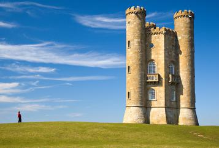
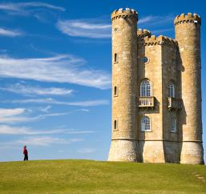
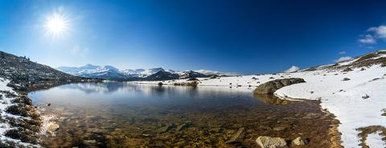
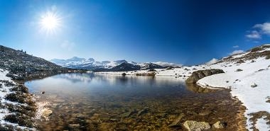
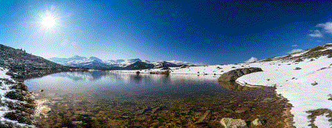
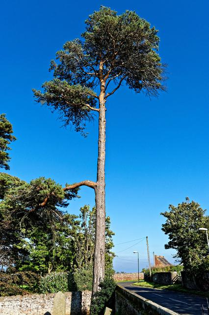
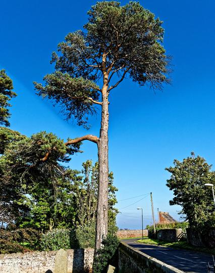

# seam-carving
> Minimalistic seam carving.

You can refer to the paper [here](https://perso.crans.org/frenoy/matlab2012/seamcarving.pdf).

## Examples
|Before|After|Procedure|
|--|--|--|
||||

|Before|After|Procedure|
|--|--|--|
||||

|Before|After|Procedure|
|--|--|--|
||||